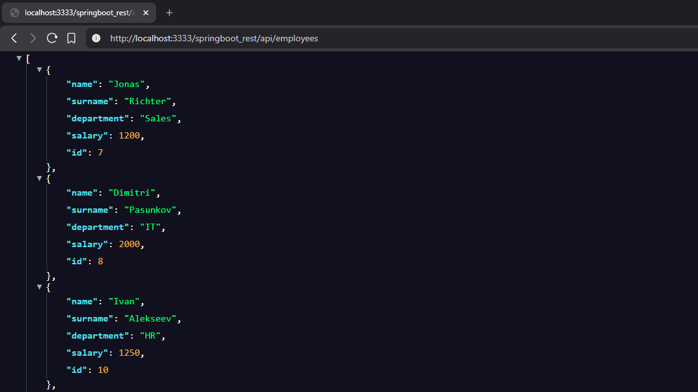

# 🚀 Spring Boot REST API (Employee Management)

🌐 RESTful CRUD application built with Spring Boot for managing employees.

This project demonstrates how to build a REST API using Spring Boot with a classic layered architecture and database interaction via JPA `EntityManager`.

## 📌 Project Overview

This is a **Spring Boot REST application** that provides endpoints to manage employees.

- Backend-focused REST API
- JSON-based communication
- Built with Spring Boot and embedded server
- Designed following REST principles and layered architecture

The application follows a layered architecture:

Controller → Service → DAO → Entity

## ✨ Features

- ✅ Full CRUD operations (Create, Read, Update, Delete)
- 🌐 RESTful API design
- 📦 JSON data exchange
- 🗄 Database interaction using JPA (`EntityManager`)
- 🧩 DAO pattern implementation
- ⚙️ Spring Boot auto-configuration
- 🚀 Embedded Tomcat (no manual deployment)

## Screenshots

### Employee List


## 🛠 Requirements

- ☕ Java 8 or higher
- 📦 Maven
- 🐬 MySQL 8.x
- 💡 IntelliJ IDEA (recommended)

## 🚀 How to Run

### 1️⃣ Clone the repository

Clone this repository to your local machine:
```bash
git clone https://github.com/Nabuchodon0ssor/spring-boot-rest-api.git
```

Or download it as a ZIP archive and extract it.

### 2️⃣ Open the project in IntelliJ IDEA

- Open IntelliJ IDEA
- Select File → Open
- Choose the root project folder spring_course_rest
- IntelliJ will automatically detect two Maven modules
- Make sure all Maven dependencies are downloaded successfully

### 3️⃣ Install and configure MySQL

Make sure **MySQL is installed and running** on your computer.

- MySQL version: **8.x**
- Default port: **3306**

You can check MySQL installation by running:

```bash
mysql --version
```

Or by opening MySQL Workbench.

### 4️⃣ Create a local database

Open MySQL Workbench (or terminal) and run:

```sql
CREATE DATABASE my_db;
USE my_db;
```
Create table
```sql
CREATE TABLE employees (
  id INT NOT NULL AUTO_INCREMENT,
  name VARCHAR(15),
  surname VARCHAR(25),
  department VARCHAR(20),
  salary INT,
  PRIMARY KEY (id)
);
```
(Optional) Add test data
```sql
INSERT INTO employees (name, surname, department, salary) VALUES
('Lucas', 'Neumann', 'IT', 1200),
('Sophie', 'Keller', 'HR', 900),
('Maria', 'Klein', 'Sales', 950);
```

✅ Database is ready.


### 5️⃣ Configure database credentials (Server)

Open the configuration file:

```markdown
src/main/resources/application.properties
```

Update credentials:

```java
spring.datasource.url=jdbc:mysql://localhost:3306/my_db?useSSL=false
spring.datasource.username=bestuser
spring.datasource.password=bestuser
```

You can change the following properties:

spring.datasource.url → database name and connection URL

spring.datasource.username → MySQL username

spring.datasource.password → MySQL password


Make sure the database name matches the one created in MySQL.


### 6️⃣ Run the Application (Main class SpringBootRestApplication)

Run main class:
```markdown
SpringbootRestApplication.java
```
### 7️⃣ Test API in browser or Postman

Base URL:
```url
http://localhost:3333/springboot_rest/api/employees
```

### 📡 API Endpoints
| Method | Endpoint             | Description        |
|--------|----------------------|--------------------|
| GET    | /api/employees       | Get all employees  |
| GET    | /api/employees/{id}  | Get employee by ID |
| POST   | /api/employees       | Create new employee|
| PUT    | /api/employees       | Update employee    |
| DELETE | /api/employees/{id}  | Delete employee    |


### 🧪 Example JSON
Create employee (POST)
```json
{
  "name": "Jonas",
  "surname": "Richter",
  "department": "Sales",
  "salary": 1600
}
```
Update employee (PUT)
```json
{
  "id": 1,
  "name": "Jonas",
  "surname": "Richter",
  "department": "Sales",
  "salary": 1600
}
```

## ℹ️ Important Notes

- Backend-focused REST API with JSON-based communication
- Persistence layer implemented using JPA `EntityManager`
- API can be tested using tools like Postman or directly via HTTP requests
- Database is configured externally and should be created locally
